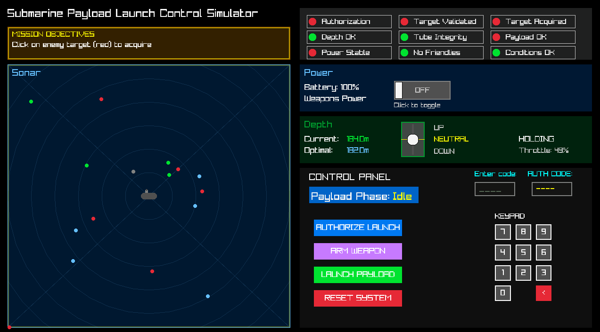

# Submarine Payload Launch Simulator

A submarine payload launch control simulator built in C++, guided by systems engineering documentation. See the documentation by clicking on the ```.md``` files in the ```docs/``` tab.

# *Play the Simulator Here!* [https://jamesdfurtado.github.io/payload-sim](https://jamesdfurtado.github.io/payload-sim)

## Overview

I designed this project with strong object-oriented, systems engineering, and testing principles to demonstrate both my technical capabilities and genuine interest in defense industry development practices.


This simulator recreates the complex environment of a submarine's payload launch system, including power management, depth control, sonar operations, target acquisition, and launch sequence handling with emphasis on safety protocols and operational correctness.

