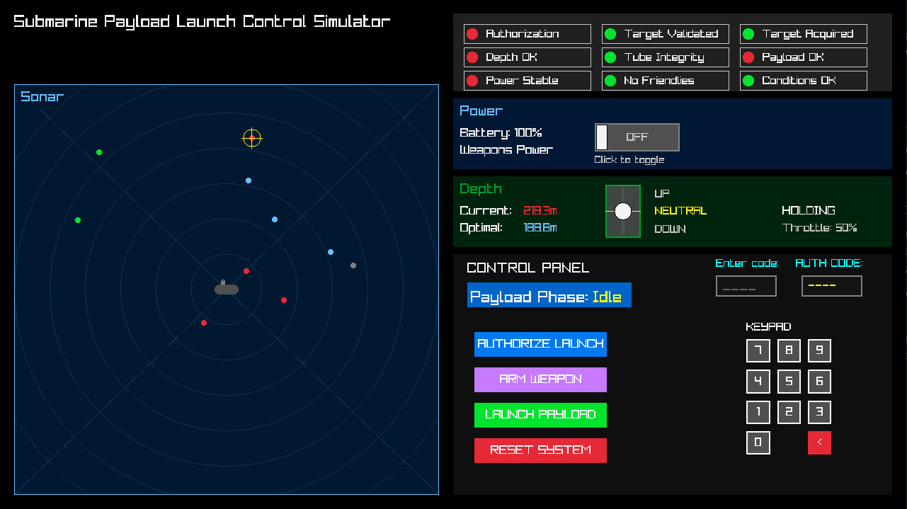

# Submarine Payload Launch Simulator

A submarine payload launch control simulator built in C++ with raylib, featuring a command center UI and systems engineering documentation.

## Overview

This simulator recreates the complex environment of a submarine's payload launch system, including power management, depth control, sonar operations, target acquisition, and launch sequence handling. I designed this project with strong object-oriented, systems engineering, and clean code principles to simulate how a real defense contracting company may develop a project like this.

## Screenshot



## Features

- **Power System Management** - Monitor and control electrical systems
- **Depth Control** - Real-time depth monitoring and adjustment
- **Sonar Operations** - Contact detection and tracking
- **Target Acquisition** - Identify and lock onto potential targets
- **Target Validation** - Verify target legitimacy and safety
- **Launch Sequence Handler** - Multi-phase launch authorization system
- **Friendly Safety System** - Prevent accidental friendly fire
- **Environment Simulation** - Realistic underwater conditions
- **Command Center UI** - Intuitive control interface with multiple views

## Requirements

- **C++17** compatible compiler
- **CMake 3.16** or higher
- **raylib 5.5** (automatically fetched if not found)
- **Windows/Linux/macOS** support

## Installation

```bash
# Clone the repository
git clone https://github.com/username/payload-sim.git

# Navigate to project directory
cd payload-sim

# Create build directory
mkdir build && cd build

# Configure and build
cmake ..
cmake --build .
```

## Usage

```bash
# Run the simulator
./payload-sim

# Or on Windows
payload-sim.exe
```

The simulator launches with a 1280x720 window and runs at 60 FPS. Use the command center interface to:

- Monitor power levels and system status
- Control depth and navigation
- Operate sonar and detect contacts
- Acquire and validate targets
- Execute launch sequences with proper authorization

## Project Structure

```
payload-sim/
├── src/                           # Source code
│   ├── main.cpp                   # Main entry point
│   ├── sim/                       # Simulation engine
│   │   ├── SimulationEngine.h     # Core simulation loop
│   │   ├── systems/               # Subsystem implementations
│   │   │   ├── PowerSystem.h      # Electrical power management
│   │   │   ├── DepthSystem.h      # Depth control
│   │   │   ├── SonarSystem.h      # Sonar operations
│   │   │   ├── TargetingSystem.h  # Target tracking
│   │   │   ├── LaunchSequenceHandler/  # Launch authorization
│   │   │   └── ...                # Other systems
│   │   └── world/                 # World simulation
│   │       ├── ContactManager.h   # Contact tracking
│   │       └── CrosshairManager.h # Targeting interface
│   └── ui/                        # User interface
│       ├── UIRoot.h               # Main UI controller
│       └── views/                 # Different UI panels
├── docs/                          # Systems engineering documentation
│   ├── Requirements Specification.md
│   ├── Requirements Traceability Matrix.md
│   └── Risk Analysis.md
└── CMakeLists.txt                 # Build configuration
```

## Systems Architecture

The simulator uses a modular systems architecture where each subsystem operates independently:

- **SimulationEngine**: Coordinates all systems and manages the main loop
- **PowerSystem**: Manages electrical power distribution and consumption
- **DepthSystem**: Handles submarine depth control and monitoring
- **SonarSystem**: Detects and tracks underwater contacts
- **TargetingSystem**: Manages weapon targeting and guidance
- **LaunchSequenceHandler**: Implements multi-phase launch authorization
- **FriendlySafetySystem**: Prevents accidental friendly fire incidents

## Building

```bash
# Standard build
cmake --build .

# Debug build
cmake --build . --config Debug

# Release build
cmake --build . --config Release

# Clean build
cmake --build . --target clean
```

## Testing

The project includes comprehensive systems engineering documentation. Review the docs/ folder for:

- Requirements specifications
- Risk analysis
- Traceability matrices

## License

This project is licensed under the MIT License - see the [LICENSE](LICENSE) file for details.